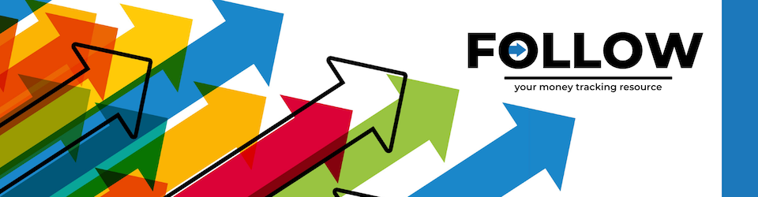

## Intro:

PLAN , TRACK, and SAVE by logging your expenditures from month to month.

## Technologies Used:

- Bcrypt
- Bootstrap
- Cors
- Express
- jSon Webtoken
- Mongoose
- Morgan
- Node
- React

## Getting Started:

[Wireframe](https://miro.com/app/board/uXjVO65UKTM=/) using Miro

[Trello-Board](https://github.com/g0livax27/Follow-App/projects/1) using GitHub Projects

[ERD](https://miro.com/app/board/uXjVO2gSYNs=/) using Miro

[Live Link](https://follow-app-v1.herokuapp.com/) via Heroku

## Unsolved Problems:

- User Authentication
- Fix delay on refresh when items are Deleted or Updated
- Previously entered notes do not show on the edit form, they should show

## Future Enhancements:

- Function to add up amounts entered to view total sum of monthly spending

## Credits:

Mindy Miller: logos and favicon images